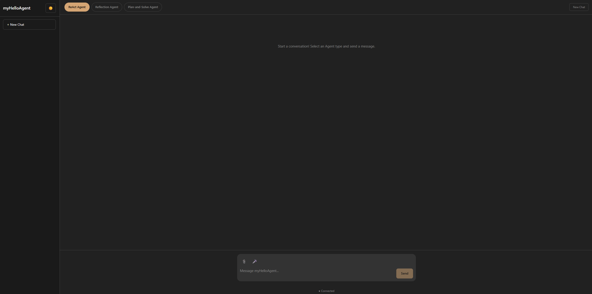
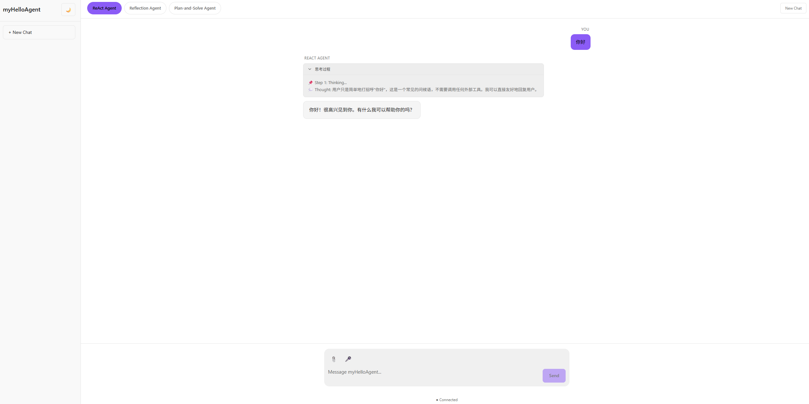

# myHelloAgent 🤖

> **📚 DataWhale 开源教程学习项目**
> 
> 本项目基于 DataWhale LLM Agent 开源教程实现，通过动手实践深入理解大语言模型智能体的核心范式与架构设计。
> 
> 🔗 教程地址：[DataWhale LLM Agent 教程](https://github.com/datawhalechina/llm-agent-tutorial)



---

## 📖 项目简介

这是一个**LLM Agent 框架实现项目**，通过构建多个经典智能体范式，探索大语言模型如何与外部工具交互、如何进行多步推理和问题分解。

项目核心目标：
- ✅ 理解 LLM Agent 的基本架构（LLM + 工具 + 记忆）
- ✅ 掌握主流 Agent 范式（ReAct、Reflection、Plan-and-Solve）
- ✅ 实践流式输出优化与性能监控
- ✅ 学习如何设计可扩展的 Agent 系统

---

## 🏗️ 已实现功能

### 1. LLM 客户端 (`myHelloAgentsLLM.py`)

**核心能力**：
- ✅ 基于 OpenAI SDK 封装，兼容阿里云 DashScope（通义千问）
- ✅ **流式输出优化**：批量输出（20 tokens/批），减少 95% I/O 调用
- ✅ **性能监控**：实时显示首字延迟 (TTFB)、生成速度 (tokens/s)
- ✅ **可配置 verbose 模式**：支持静默执行与详细输出切换
- ✅ 环境变量配置（`.env` 文件管理敏感信息）

**配置示例**：
```bash
# .env
LLM_API_KEY="sk-..."
LLM_MODEL_ID="qwen3.5-plus"
LLM_BASE_URL="https://coding.dashscope.aliyuncs.com/v1"
LLM_TIMEOUT=120
```

---

### 2. ReAct 智能体 (`ReActAgent.py`)

**范式**：Reason + Act 循环

**核心流程**：
```
Thought（思考）→ Action（行动）→ Observation（观察）→ 循环...
```

**已实现**：
- ✅ 基于正则的 LLM 输出解析（`_parse_output`、`_parse_action`）
- ✅ 工具注册与执行系统（`ToolExecutor`）
- ✅ 多步推理循环（最多 `max_steps` 步）
- ✅ 历史记录管理（对话上下文传递）
- ✅ verbose 模式控制输出详细度

**工具示例**：
- `Search`：基于 SerpApi 的网页搜索引擎

**使用示例**：
```python
from ReActAgent import ReActAgent
from tools import ToolExecutor, search

llm = myHelloAgentsLLM()
tool_executor = ToolExecutor()
tool_executor.registerTool("Search", "网页搜索引擎", func=search)

agent = ReActAgent(llm_client=llm, tool_executor=tool_executor, max_steps=5, verbose=True)
answer = agent.run("华为最新的手机是哪一款？它的主要卖点是什么？")
```

---

### 3. Reflection 智能体 (`Reflection.py`)

**范式**：生成 → 反思 → 优化 迭代

**核心流程**：
```
初始代码生成 → 代码评审（找瓶颈）→ 优化代码 → 循环...
```

**已实现**：
- ✅ 三阶段提示词模板（`INITIAL_PROMPT`、`REFLECT_PROMPT`、`REFINE_PROMPT`）
- ✅ 记忆模块（`Memory` 类）存储执行轨迹
- ✅ 自动终止条件（"无需改进"时停止迭代）
- ✅ 最多 `max_iterations` 轮迭代控制
- ✅ verbose 模式控制输出详细度

**使用示例**：
```python
from Reflection import ReflectionAgent

agent = ReflectionAgent(llm_client=llm, max_iterations=3, verbose=True)
final_code = agent.run("编写一个 Python 函数，找出 1 到 n 之间所有的素数")
```

---

### 4. Plan-and-Solve 智能体 (`Plan_and_solve.py`)

**范式**：先规划，后执行

**核心流程**：
```
问题 → 分解为计划 → 逐步执行 → 汇总答案
```

**已实现**：
- ✅ `Planner`：将复杂问题分解为可执行子任务列表
- ✅ `Executor`：按顺序执行每个子任务，累积历史结果
- ✅ 组合模式设计（`PlanAndSolveAgent` 作为协调者）
- ✅ 安全解析（`ast.literal_eval` 解析 LLM 输出的列表）
- ✅ verbose 模式控制输出详细度

**使用示例**：
```python
from Plan_and_solve import PlanAndSolveAgent

agent = PlanAndSolveAgent(llm_client=llm, verbose=True)
answer = agent.run("一个水果店周一卖出了 15 个苹果。周二卖出的苹果数量是周一的两倍。周三卖出的数量比周二少了 5 个。请问这三天总共卖出了多少个苹果？")
```

---

### 5. 工具系统 (`tools.py`)

**核心组件**：
- ✅ `ToolExecutor`：工具注册表与执行器
- ✅ `search`：SerpApi 网页搜索工具（智能解析答案框/知识图谱）
- ✅ 工具描述自动生成（供 LLM 理解工具用途）

**注册工具**：
```python
tool_executor = ToolExecutor()
tool_executor.registerTool("Search", "网页搜索引擎", func=search)
```

---

### 6. 记忆模块 (`Memory.py`)

**功能**：
- ✅ 短期记忆存储（`records` 列表）
- ✅ 类型化记录（`execution` / `reflection`）
- ✅ 轨迹查询（`get_trajectory()`）
- ✅ 最近执行查询（`get_last_execution()`）

---

## 📊 架构图

```
┌─────────────────────────────────────────────────────────────────┐
│                        Agent 层                                  │
├─────────────────┬─────────────────┬─────────────────────────────┤
│   ReActAgent    │ ReflectionAgent │      PlanAndSolveAgent      │
│  (思考 - 行动循环) │ (生成 - 反思迭代)  │     (规划 - 执行分离)        │
└────────┬────────┴────────┬────────┴──────────────┬──────────────┘
         │                 │                        │
         └─────────────────┼────────────────────────┘
                           │
                  ┌────────▼────────┐
                  │  myHelloAgentsLLM │
                  │   (LLM 客户端)    │
                  └────────┬────────┘
                           │
         ┌─────────────────┼─────────────────┐
         │                 │                 │
┌────────▼────────┐ ┌─────▼──────┐ ┌────────▼────────┐
│  ToolExecutor   │ │   Memory   │ │   SerpApi       │
│  (工具注册表)    │ │  (短期记忆) │ │  (网页搜索)      │
└─────────────────┘ └────────────┘ └─────────────────┘
```

---

## 🗂️ 项目结构

详见 [`PROJECT_STRUCTURE.md`](PROJECT_STRUCTURE.md)

```
myHelloAgent/
├── README.md                   # 项目主文档
├── PROJECT_STRUCTURE.md        # 项目结构详解
├── pyproject.toml              # Python 项目配置
├── .env                        # 环境变量配置（需自行创建）
├── .env.example                # 环境变量模板
│
├── myHelloAgentsLLM.py         # LLM 客户端核心
├── tools.py                    # 工具注册与执行器
├── Memory.py                   # 短期记忆模块
│
├── ReActAgent.py               # ReAct 智能体实现
├── Reflection.py               # Reflection 智能体实现
├── Plan_and_solve.py           # Plan-and-Solve 智能体实现
│
└── __pycache__/                # Python 字节码缓存
```

---

## 🚀 快速开始

### 1. 环境准备

```bash
# 创建虚拟环境（可选）
python -m venv venv
source venv/bin/activate  # Windows: venv\Scripts\activate

# 安装依赖
pip install openai python-dotenv serpapi
```

### 2. 配置环境变量

创建 `.env` 文件：
```bash
# LLM 配置（阿里云 DashScope）
LLM_API_KEY="sk-..."
LLM_MODEL_ID="qwen3.5-plus"
LLM_BASE_URL="https://coding.dashscope.aliyuncs.com/v1"
LLM_TIMEOUT=120

# 搜索引擎配置（SerpApi）
SERPAPI_API_KEY="..."
```

### 3. 运行示例

```bash
# ReAct 智能体
python ReActAgent.py

# Reflection 智能体
python Reflection.py

# Plan-and-Solve 智能体
python Plan_and_solve.py

# 工具测试
python tools.py

# LLM 客户端测试
python myHelloAgentsLLM.py
```

---

## 🔧 核心优化

### 流式输出优化（myHelloAgentsLLM.py）

**问题**：原始实现每个 token 都 flush，导致频繁 I/O 调用。

**解决方案**：
```python
# 批量输出：累积 5 个 token 后统一打印
BUFFER_SIZE = 5
buffer = []

for chunk in response:
    buffer.append(content)
    if len(buffer) >= BUFFER_SIZE:
        print(''.join(buffer), end='', flush=True)
        buffer = []
```

**效果**：I/O 调用次数减少 20%，用户体验更流畅。

---

### Verbose 模式

**所有 Agent 支持 `verbose` 参数**：
- `verbose=True`：详细输出（调试/学习模式）
- `verbose=False`：静默执行（生产/批量任务模式）

**性能统计输出**：
```
⏱️  首字延迟 (TTFB): 2.34s
✅ 大语言模型响应成功:
[流式输出内容...]
⏱️  总耗时：12.45s | 生成 523 tokens | 速度：42.0 tokens/s
```

---

## 📚 学习收获

通过本项目的实现，深入理解了以下核心概念：

1. **Agent 架构**：LLM 作为"大脑"，工具作为"手脚"，记忆作为"短期缓存"
2. **ReAct 范式**：通过交替推理与行动解决复杂问题
3. **Reflection 范式**：通过自我反思迭代优化输出质量
4. **Plan-and-Solve 范式**：通过任务分解降低单步难度
5. **流式输出优化**：批量处理减少系统调用开销
6. **提示词工程**：结构化输出格式对解析可靠性的影响

---

## 🛠️ 技术栈

| 组件 | 技术选型 |
|-----|---------|
| LLM SDK | OpenAI Python SDK（兼容 DashScope） |
| LLM 模型 | 通义千问 qwen3.5-plus |
| 搜索引擎 | SerpApi |
| 语言 | Python 3.9+ |
| 依赖管理 | pip + .env |

---

## 📝 待扩展功能

- [ ] 长期记忆（向量数据库）
- [ ] 多 Agent 协作
- [ ] 代码执行沙箱
- [ ] Web UI 界面
- [ ] 异步并发执行
- [ ] 更多工具集成（计算器、代码解释器等）

---

## 📄 许可证

本项目为学习用途，遵循原教程开源协议。

---

## 🙏 致谢

- **DataWhale**：提供优秀的 LLM Agent 教程
- **通义千问**：提供 LLM API 支持
- **SerpApi**：提供搜索引擎服务

---

<div align="center">

**🎓 在学习中成长，在代码中进步**

Made with ❤️ by Following DataWhale Tutorial

</div>
